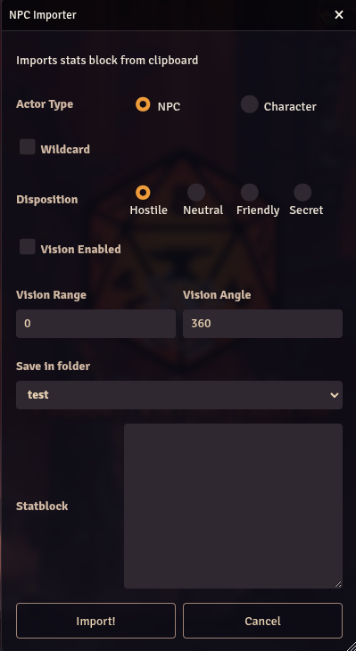
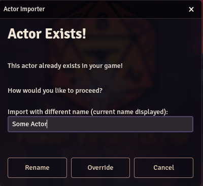

# SWADE Stat Block Importer

(formerly **_SWADE NPC Importer_**)

A Savage Worlds Adventure Edition stat block importer for [Foundry VTT](https://foundryvtt.com)

---

### :exclamation: **Please Note**

1. If you are running Foundry as self-hosted, and with the HTTP protocol, then the Importer _might_ not be able to read the data from the clipboard (this is security realted stuff). It will usually be represented by the following error in the browser console: `Cannot read property 'readText' of undefined`.

   To solve this either:

   - Set your hosted Foundry to work with HTTPS, or
   - Set the `Insecure origins treated as secure` flag in your browser (or equivalent) appropriatly ([see here for an explanation](https://github.com/arnonram/swade-npc-importer/issues/42#issuecomment-773385058))

2. **_Firefox_** does not support the `clipboard.readText()` API, and I found no way around this.

:smiley: **The Solution**: The Actor Importer dialog has a text-box into which you may paste the statblock. This will by-pass both of these problems.

---

## Just a heads up about statsblocks

The **_SWADE Stat Block Importer_** works with the official statblock as seen in any Pinnacle products (SWADE Core, Deadlands, etc..) and defined in the [Pinnacle Style Guide](https://peginc.com/store/pinnacle-style-guide-pdf/)

The Importer basically searches for patterns in the text, so that means paying attention to commas, colons, etc...

:warning: When copying from PDFs you'll sometime get spaces inside words (example: `Arc ane`), at this point in time, the importer will not know how to handle these.

## How to use it...

0. Go to [Settings](#some-configurations) and look around:

   - Under **_Select Item Compendiums_** mark any Compendium you wish NPC Importer to use (not selecting anyting will cycle through all compendiums and use the first relevant entry)
   - Set up any other default values you might want

1. Copy the desired statblock (ctr/cmd + c, into the clipboard)
2. Click on the NPC Importer button at the buttom of the **Actors Directory**

   

3. Choose desired options & Click Import!

   

4. In case an Actor with the same name already exists, then you have some options
   

## Some configurations

On first use (or, you know, whenever), it is recommended to look at the default settings


It is highly recommended to choose the Package and/or Item Compendiums you wish NPC Importer to use while importing


Some _Prototype Token_ options may be set by default


---

## How it does it and what's supported

1. The statblock is prased by searching for all supported attributes/traits/items/etc..
   - Any _Additional Stats (Actors)_ which were added through the SWADE System Settings are: searched for, added, and enabled.
     - Only number, text, or die stats are parsed
   - Traits/Item means: skills, Edges, Hindrances, Special Abilities, Gear, Powers, etc..
2. Every trait/item is searched for throughout all Item Compendiums in the selected Package (See [NPC Importer Settings](#some-configurations))
3. If the triat/item is found in a Compendium then it is copied and updated to the Actor; If not found, then a new one will be created for the Actor only (no new compendium entry is created)

### What's supported:

- **Attributes**
- **Skills**
  - Core Skills are set according to the SWADE System Settings -> Setting Configurator
- **Hindrances**
- **Edges**
  - Initiative Edges are checked in the _tweaks_ sections of the Actor
- **Powers** & **Power Points**
- **Super Powers** (Super Powers Companion)
  - Full support for `swade-supers-companion.superPower` item type
  - Automatic compendium lookup with fallback to ability items
  - Preserves trappings (e.g., "Attack (Ranged, Electricity)")
  - Requires Super Powers Companion packs enabled in settings
- **Pace**
- **Parry**
- **Toughness**
  - Set Auto-calculate to `false` by default
- **Bennies**

  - Bennies are set according to the table below.
  - **_Note:_** Edges/Hindrances affecting bennies are not taken into account

  | Actor Type | Wild Card | Max/Current Bennies |
  | :--------: | :-------: | :-----------------: |
  |    NPC     |    No     |         0/0         |
  |    NPC     |    Yes    |         2/2         |
  | Character  |    No     |         0/0         |
  | Character  |    Yes    |         3/3         |

- **Gear**

  - _Equipped_ by default
  - Weapons (melee & ranged)
    - If weapon does not have Range, then related skill will be _Fighting_
    - If weapon has range, then related skill will be _Shooting_
  - Armors
  - Shields
  - Gear

- **Special Abilities**

  - Search for "Armor" and/or any damage attack (lines with Str., Str+d\*, or dice formulas).
    - You may select from the settings to not search for these special items, and then they will all be listed as Special Abilities Items
  - Lists all others as Special Abilities Items
  - Size
    - Size influences the tokens' size (bigger than medium) and scale (for smaller than medium)
    - Add additional wounds as per the Size Table (SWADE Core)
  - Ignore wounds & Unshake bonuses for: construct, undead, elemental, combat reflexes
  - List them all in the actors' description with links to Compendium rules (if using the core-swade Compendium pack)
  - See [NPC Importer Settings](#some-configurations) for further manipulation of the statblock.

    - This options allows users who have set Special Abilities as Eges in their World to link them, as well as
    - Forcing the Importer to consider some Spcial Abilities as specific Items => For example: this means that you can add a `@a` to force the Importer to consider the special ability as Armor. The existing options are:

      - `@e` => Edge;
      - `@h` => Hinrance;
      - `@w` => Weapom;
      - `@a` => Armor;
      - `@sa` => listed as Special Ability item"
      - **For example**:

        ```
        Some Monster
        Stuff about the monster. Lots of it..
        Attributes: Agility d8, Smarts d6, Spirit d6,
        Strength d10, Vigor d10
        Skills: Athletics d6, Fighting d8, Notice d6,
        Shooting d8, Stealth d8
        Pace: 6; Parry: 6; Toughness: 7
        Edges: Combat Reflexes
        Special Abilities:
        @sa Aquatic: Pace 12″.
        @e Burrow (10″): Some Monsters can meld
        into and out of the ground
        @w Slam: Str+d6, nonlethal damage.
        @a Armor +2
        @h Weakness(dirt): Some Monster hate being dirty
        @sa SpecialAbs: this is a ver special Abilitiy
        ```

### Super Powers Support

The importer now has **full support** for the Super Powers Companion! When importing superhero stat blocks, use the following format:

```
Captain Thunder
A mighty superhero with control over electricity and storm.
Protector of Metro City since the 1940s.

Attributes: Agility d8, Smarts d8, Spirit d10, Strength d12+2, Vigor d10
Skills: Athletics d10, Fighting d10, Flying d8, Focus d10, Intimidation d8, Notice d8
Pace: 6; Parry: 7; Toughness: 12 (3)
Edges: Ambidextrous, Combat Reflexes, Level Headed, Super Powers
Super Powers: Attack (Ranged, Electricity), Flight, Super Attribute (Strength), Toughness
Power Points: 30
Gear: Costume (+3 Armor, bulletproof)
Special Abilities:
@sa Electrical Immunity: Immune to electrical damage
@sa Storm Control: Can create weather effects within 1 mile
```

**Key Features:**

- **Super Powers Section**: Comma-separated list of powers from Super Powers Companion
- **Focus Skill**: Essential for controlling super powers (linked to Spirit)
- **Trappings Support**: Preserves modifiers like "Attack (Ranged, Electricity)"
- **Item Creation**: Creates proper Super Power items when found in compendiums
- **Fallback**: Creates Ability items for unknown or custom powers

**Requirements:**

- Enable Super Powers Companion packs in NPC Importer settings
- Recommended pack: `swade-supers-companion.superpowers`

---

## Supported Languages

Support is for both the UI and parsing of statblock

- English
- Español (thanks @Montver)
- Português (Brasil) (thanks @lipefl)
- Deutsch (thanks @Razortide)

> **_Please Note:_** I work mainly with English sources, and I do try to test with the supported languages, but, due to the few non-English stat-blocks I have and due to translation quirks, there will be more issus with the non-English.
> My Apologies for that :)

> **_Adding More Languages:_** If you wish to add support for more languages, please don't hesitate to create a pull request or open an issue with the file attached.
